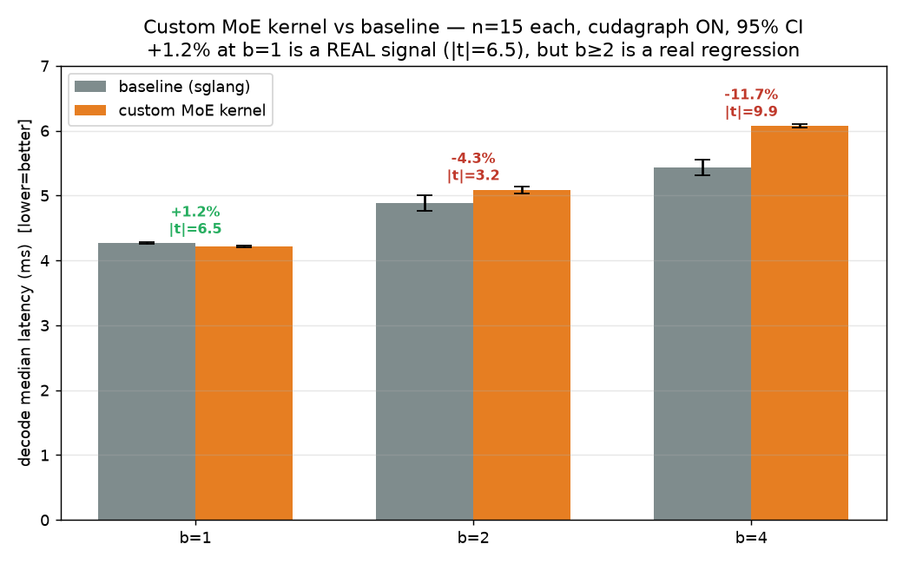

# 噪声验证：custom MoE kernel 的 b=1 "+1.4%" 是真信号还是波动？（Chendi 要求）

**日期**：2026-07-20 · **提出人**：Chendi · **模型**：Qwen3-30B-A3B / H200 / bf16
**问题**：之前报告的 custom MoE kernel 端到端 b=1 **+1.4%** 提升，是统计波动还是真实提升？

## TL;DR
**是真信号，不是波动** —— 但很小（+1.17%，约 0.05ms），且**只在严格 b=1**；b≥2 是统计显著的**真回归**（−4% ~ −12%）。

## 方法（严格版，与原始测量条件一致）
- 工具：`sglang.bench_one_batch`，in=256，out=64，`--attention-backend fa3 --moe-runner-backend triton`，**cudagraph ON**（与原始 +1.4% 测量同条件）。
- **每个配置独立启动进程 15 次**（baseline=CUSTOM_MOE=0 vs custom=CUSTOM_MOE=1），**交错启动顺序**以抵消热漂移/系统噪声。
- 每次取该进程内 63 个 decode step 的 median latency；跨 15 次进程计算均值、std、95%CI 和 Welch t 检验。
- custom kernel 确认触发（decode M≤4 时 432 次 custom 调用，prefill fallback）。
- 脚本：`scripts/run_v41_noise_verify.py`；原始数据：`logs/v41_noise_verify.log`、`results/2026-07-20_v41_noise/summary.json`。

## 结果（decode median latency，ms，越低越好）

| batch | baseline | custom | delta（+=custom更快） | \|t\| | baseline 95%CI 噪声带 | 判定 |
|---|---|---|---|---|---|---|
| **1** | 4.267 ± 0.025 | 4.217 ± 0.016 | **+1.17%** | **6.51** | ±0.30% | **真信号** |
| 2 | 4.881 ± 0.232 | 5.091 ± 0.107 | −4.29% | 3.17 | ±2.41% | 真回归 |
| 4 | 5.436 ± 0.241 | 6.074 ± 0.061 | −11.74% | 9.92 | ±2.25% | 真回归 |

判定阈值：\|t\|>2.0 ≈ p<0.05。三组全部 \|t\|>3，均为统计显著。

## 解读
1. **b=1 +1.17% 是真的**：\|t\|=6.51（p<0.001），delta 是 baseline 噪声带（±0.30%）的约 **4 倍**，两组 std 都很小（<0.03ms）。所以之前的 "+1.4%" 不是运气——它是一个**真实但极小**的效应（绝对 ~0.05ms / 4.27ms）。
2. **注意它 NOT 来自 launch 节省**：cudagraph 已隐藏 launch 开销，却仍有 +1.17% → 说明是 kernel 在 M=1 时**GPU 计算本身更省**（跳过 align/sort/padding），而非省 launch。
3. **b≥2 是真回归，不是噪声**：b=2 −4.3%（\|t\|=3.2）、b=4 −11.7%（\|t\|=9.9），都统计显著。custom 按 (token,expert) pair 逐个处理，在 M≥2 被 sglang 的专家分组反超。

## 结论（给 Chendi）
- **原 +1.4% 复现为 +1.17%，是真信号（\|t\|=6.5），非波动。** 但幅度极小、仅限 b=1、且 b≥2 转为真回归。
- 因此先前的诚实判断成立：**这个 custom MoE kernel 作为通用改动不成立**——它只在"严格单请求 decode"给出 ~1% 的真实但可忽略的收益，一旦 batch≥2 就是净负。
- 方法论收获：**要区分"真信号 vs 噪声"必须多次重复 + t 检验**；单点甚至 3 次中位数都可能误判方向（这次 15 次才把 b=2 的方向和显著性钉死）。
