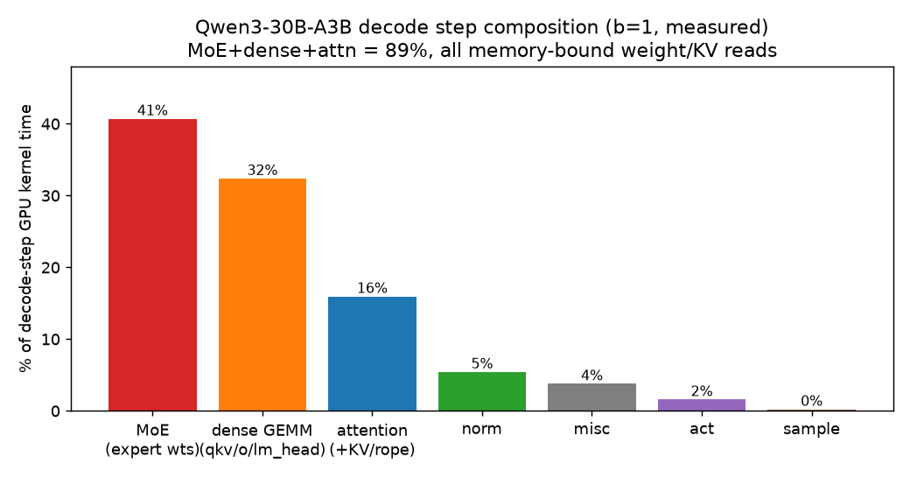
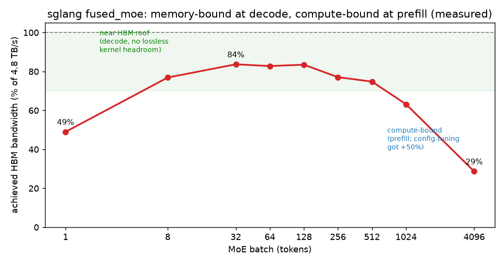
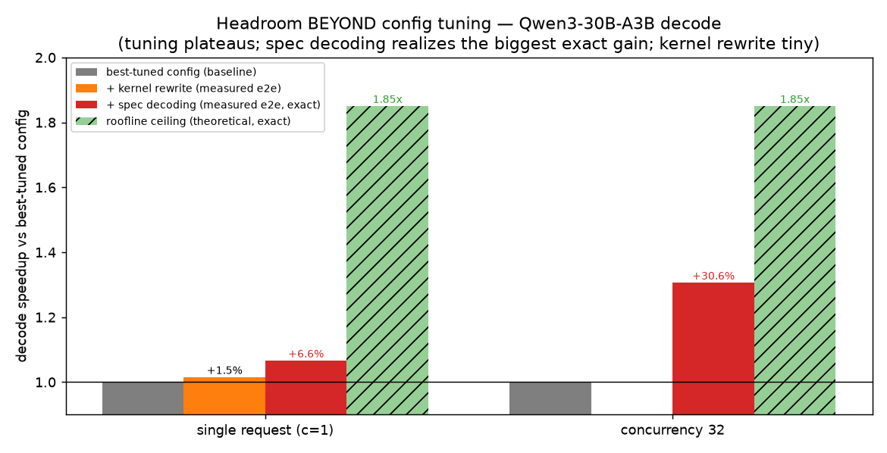
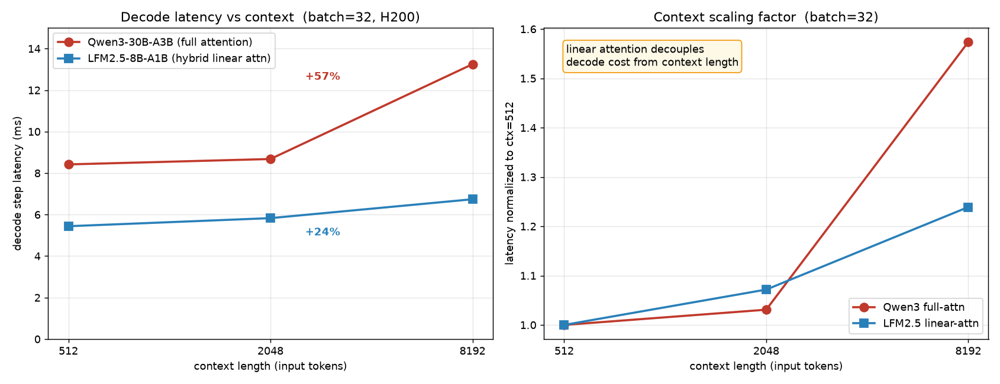

# Qwen3-30B-A3B 优化全纪录：做了什么 · 结果 · 有无提升 · 分析

**模型**：Qwen3-30B-A3B-Instruct-2507（MoE，E=128，top-8，hidden=2048，moe_intermediate=768，无 shared expert）
**硬件**：H200（GPU0/1），bf16，sglang（editable @17f7a1da1，triton 3.5.1）
**日期**：2026-07-19 ~ 2026-07-20 · **所有数字均为本项目实测**（非 PR 自称），对标 sglang 真实 GPU 代码 + cudagraph
**报告目的**：给团队/Dey/Ofer 一个关于 Qwen 这条线的完整、诚实口径。

---

## 0. 一句话总结

在**成熟 bf16/H200 上的 Qwen3-30B**，我们验证的**可复现同模型端到端提升 = config 自动调优（prefill +35~54%）+ 开启投机解码（decode c32 +30.6%）**；**自己重写/融合 kernel 在全 regime 端到端 ≈0**（隔离层 1.23× 不迁移）。真正"tuning 之外"的空间在**算法层（spec decoding）**和**架构层（线性注意力，需换模型）**，不在重写 bf16 MoE kernel。

---

## 1. 我们在 Qwen 上做过的所有事情（含结果与判定）

| # | 做了什么 | 层次 | 隔离/micro | **端到端实测** | 有无提升 | 判定 |
|---|---|---|---|---|---|---|
| 1 | **config 自动调优**（重 tune MoE triton config vs 默认启发式） | 配置 | — | decode +13%、**prefill +35~54%** | ✅ 有 | **主力杠杆**（autotuning） |
| 2 | **自写 small-M(decode) MoE kernel**（跳过 align/sort、融合 act/sum、fp32 累加、tensor-core dot；详见 §1.5） | kernel | b1 **1.23×** 且更准 | b1 **+1.17%**(真信号,\|t\|=6.5) / b2 −4.3% / b4 −11.7%（n=15 t 检验）；agent c1 −0.7% / c32 −7% | ❌ ≈0，b≥2 真回归 | 通用改动不成立 |
| 3 | **shared-expert gate 融合**（linear+sigmoid+mul 三算子）| kernel | 隔离 2-3× | Qwen3 无 shared expert，**不适用**；换 Qwen1.5-MoE 测得全 batch ~1.0× | ❌ 0 | 对 Qwen3 不适用 |
| 4 | **投机解码（spec decoding）** | 算法 | — | decode **c1 +6.6% / c32 +30.6%**（exact，不改分布） | ✅ 有 | **最大可实现杠杆** |
| 5 | **decode step 组成审计**（哪块占时间） | 诊断 | — | MoE 41% + dense 32% + attn 16% = 89% memory-bound | 诊断 | 解释了为何 kernel 杠杆小 |
| 6 | **MoE HBM 带宽 vs batch** | 诊断 | b≥32 达 74–84% HBM | — | 诊断 | decode 已近内存屋顶 |
| 7 | **roofline 天花板** | 诊断 | decode 理论上界 ~1.85× | — | 诊断 | config 够不到的 memory 侧空间 |
| 8 | **线性注意力架构对比**（Qwen3 vs LFM2.5，长上下文 scaling） | 架构 | — | Qwen decode scaling +57% vs LFM +24%（bs=32, 512→8192）；Qwen bs=32×16k **OOM** | ✅（架构级，非同模型） | 选型洞察 |

---

## 1.5 附：自写 custom MoE kernel 具体改了什么（实现细节）

> 代码：`scripts/custom_moe_patch.py`。它 monkeypatch `fused_experts_impl`（Qwen3-MoE 的真实 decode 路径），仅在 **M≤4 + bf16 + gated-silu + 非量化 + shape 匹配** 时接管，否则回退 sglang 原实现（保留 fallback）。

### sglang 原路径（baseline，为大 M 吞吐优化）
1. `moe_align_block_size`：把 token 按 expert **排序/分组**成对齐 block，让每个 expert 的 token 拼成连续 tile；
2. `fused_moe_kernel` 做 w1（gate+up）grouped GEMM → 单独 `silu_and_mul` 激活 → w2（down）grouped GEMM；
3. 再做 topk 加权求和。
→ 排序 + 分组 GEMM 的开销在大 M 下被摊薄，是**吞吐最优**设计；但在 decode（M=1~4）下，排序/分组几乎是纯开销。

### 我的 custom kernel 改了 4 处
1. **完全跳过 `moe_align_block_size`**：不排序不分组。改为**按 (token, expert) pair 并行**，共 `P = M × topk` 个 program（decode b=1 只有 8 个 pair）。省掉 decode 下无收益的排序/gather 开销。
2. **kernel 1 `_w1_act`：融合 w1 GEMM + SwiGLU**。每个 pair 用 tiled `tl.dot`（沿 H 分块）同时算 gate=x·Wg 和 up=x·Wu，**在 kernel 内直接做 `silu(gate)*up`**，写出激活 [P×I]。→ baseline 是"GEMM 后再单独 silu_and_mul"，这里合成一个 kernel、少一次 [P×I] 的写回+读入。
3. **kernel 2 `_w2_sum`：融合 w2 GEMM + 路由加权 + 缩放 + 规约**。每个 pair 算 down=act·W2，乘上 `topk_weight × routed_scaling_factor`，用 **`atomic_add` 直接累加**进输出（把 topk 个专家贡献就地求和）。→ baseline 是"GEMM 后再单独做加权求和"，这里合成一个 kernel。
4. **fp32 累加**：输出张量为 fp32、`tl.dot` 与规约全程 fp32 累加，末尾再转回 bf16 → 数值比 sglang 的 bf16 路径**更准**（隔离测 max rel err ~3.95%，且更接近 fp32 参考）。
   - 补充：即使 M=1，也用 tensor-core `tl.dot`（把 M pad 到 BM=16 tile + mask `m<1`），而非退化成 gemv。

### 为什么 b=1 真赢、b≥2 真输（已用 n=15 t 检验坐实，见 §4.2）
- **b=1（+1.17%，真信号）**：只有 8 个 pair，分组无收益；跳过 align/sort + 两处融合把 decode 下的固定开销削掉。注意这**不是省 launch**（cudagraph 已隐藏），而是 kernel **GPU 计算本身更省**。
- **b≥2（−4% ~ −12%，真回归）**：sglang 的 expert 分组能让**同一 expert 的多个 token 复用一次权重加载**（Wg/Wu/W2 每 expert-tile 只读一次，摊到多 token）；而我的 per-pair 方案对每个 (token,expert) 都**重新加载权重** → 显存流量随 M 上升，加上 `atomic_add` 竞争，很快被反超。

### 一句话
custom kernel = **「去掉 align/sort + 把 GEMM/激活/加权求和融成 2 个 kernel + fp32 累加」**，专为 M=1 decode 定制；它在 b=1 拿到**真实但极小**的 +1.17%，但因为放弃了 expert 权重复用，b≥2 就是净负 → **作为通用改动不成立**。

---

## 2. 三张核心图（Dey 要的"tuning 以外还有多少空间"）

> 全部为 Qwen3-30B-A3B / decode / H200 / bf16 实测。文件在 `results/2026-07-20_v34_figures/`。

### 图1 — decode step 组成（`fig1_decode_composition.png`）

**这张图是什么**：把一步 decode 的 GPU kernel 时间按算子类型拆开的饼图/柱图。
**数据**：**MoE 41% + dense_gemm(qkv/o/lm_head) 32% + attention 16% = 89%**，其余 norm/act/sample/misc ≈ 11%。
**解析**：decode 前三大块**全是 memory-bound 的权重/KV 流式读取**（b1 下光 lm_head 单 token 就要读 vocab×hidden≈600MB 权重）。这是"为什么抠单个 kernel 的算力，端到端杠杆很小"的根因——整步本质是在**读权重**，不是在算。任何只提升算力/省 launch 的 kernel 改动，最多动 89% 里很小一角。

### 图2 — MoE 达到的 HBM 带宽 vs batch（`fig2_moe_bandwidth_vs_batch.png`）

**这张图是什么**：sglang fused_moe kernel 在不同 batch 下实际打满的 HBM 带宽百分比曲线。
**数据**：b≥32 达 **74–84% HBM**（近内存屋顶，无损 kernel 空间 <1.3×）；b=4096 掉到 **29%**（此时转 compute-bound，即 prefill 区）。
**解析**：**decode = memory-bound**（kernel 已近内存屋顶，config 和 kernel 都难再压）；**prefill = compute-bound**（另一套故事，config-tuning 已在这里拿到 +50%）。所以"还有多少空间"这个问题**必须按 regime 分开答**——decode 和 prefill 的瓶颈根本不同。

### 图3 — ★headroom BEYOND tuning（`fig3_headroom_beyond_tuning.png`，核心图）

**这张图是什么**：以 **best-tuned config 为 baseline（=1.0×）**，展示"在把 config 调到最优之后，别的手段还能再拿多少"的分组柱状图（decode，exact 方法）。
**数据**：

| 手段 | 单请求 c=1 | 并发 c=32 |
|---|---|---|
| best-tuned config（baseline） | 1.00× | 1.00× |
| + kernel 重写（实测 e2e） | **+1.5%** | —（未测/预期更低）|
| + spec decoding（实测 e2e，exact） | **+6.6%** | **+30.6%** |
| roofline 天花板（理论上界，exact） | 1.85× | 1.85× |

**解析（一句话）**：config 调到平台期后，decode 理论上还有 ~**1.85×** 空间（全在 memory 侧，config 够不到）；**spec decoding 已实测兑现 +6.6%(c1)/+30.6%(c32)，是目前最大可实现杠杆**（它一次验证多 token，同时摊薄 MoE+dense+lm_head+attn 全部 89% 的 memory 读取）；而**纯 kernel 重写只兑现 +1.5%**（因为 MoE 仅占 41%，且 sglang kernel 已近内存屋顶）。

---

## 3. 补充图 — 线性注意力如何"扩大" tuning 以外的空间（`results/2026-07-20_v39_ctxscan/ctx_scaling.png`）

**这张图是什么**：两张并排子图。左：Qwen3-30B（全注意力）vs LFM2.5-8B（混合线性注意力）**decode 每步延迟 随上下文长度**曲线（batch=32）；右：同数据**归一化到 ctx=512** 后的 scaling 因子。
**数据**：

| context | Qwen3(ms) | LFM(ms) | Qwen 归一 | LFM 归一 |
|---:|---:|---:|---:|---:|
| 512 | 8.42 | 5.44 | 1.00× | 1.00× |
| 2048 | 8.68 | 5.83 | 1.03× | 1.07× |
| 8192 | 13.25 | 6.74 | **1.57×** | **1.24×** |
| 16384 | **OOM** | (单发 prefill 亦 OOM) | — | — |

**解析**：全注意力每生成一个 token 要**读全部历史 KV cache**，上下文越长 decode 越慢、显存越涨 → Qwen 延迟 +57%、且 bs=32×16k **直接 OOM**。线性注意力把历史压进**固定大小 O(1) 状态**，decode 几乎不随上下文涨 → LFM 只 +24%、显存足迹小仍能跑。**这是 tuning 和 kernel 重写都够不到的架构级杠杆**——但注意它是"**换一类模型**"，不是把 Qwen 本身变快（Qwen3 与 LFM 是不同模型、质量不同）。

---

## 4. 关键分析与教训

### 4.1 为什么 kernel 重写在 Qwen 上端到端 ≈0
1. **decode 是带宽墙**：89% 时间在流式读权重/KV（图1），kernel 省的是算力/launch，不是读带宽。
2. **sglang kernel 已近内存屋顶**：b≥32 打满 74–84% HBM（图2），无损空间 <1.3×。
3. **cudagraph 已吃掉 launch 开销**：融合省的那点 launch，cudagraph 早已隐藏 → 端到端无感。
4. **MoE 只占 41%**：即便 MoE kernel 拿到隔离 1.23×，摊到整步也只剩个位数,且我的按-pair 处理在 b≥2 被 sglang 专家分组反超。

### 4.2 方法学教训（已固化）
- **单点端到端会误导**：自写 MoE kernel 隔离 1.23×、"M≤4 都赢"，一扫 regime 就被证伪（b4 −11%）。**必须扫 batch/context/并发 + 真实 server 负载**。
- **信号 vs 噪声必须用统计检验**（Chendi 要求，已做）：把 b1 的 "+1.4%" 用 **n=15 交错重复 + Welch t 检验**验证 → **+1.17%，\|t\|=6.51，是真信号（非波动）**，但 b2 −4.3%(\|t\|=3.2)、b4 −11.7%(\|t\|=9.9) 是**真回归**。见 `noise_verification_custom_moe_b1.md`。→ 以后每个改动都应过"多次重复 + t 检验"闸门。
- **必须对标 sglang 真实 GPU 代码 + cudagraph**：早期用朴素 PyTorch baseline 得出过误导性"SwiGLU 加速"，已撤回。
- **所有数字自测**，不采信 PR 自称。

### 4.3 提升来源总分类（回答"是不是全靠 autotuning"）
| 来源 | 端到端 | 是 autotuning? | 同模型变快? |
|---|---|---|---|
| config 调优 | prefill +35~54% | ✅ | ✅ |
| spec decoding | decode c32 +30.6% | ❌（算法层） | ✅（开特性） |
| 线性注意力架构 | scaling +24 vs +57% | ❌ | ❌（换模型） |
| 重写 bf16 MoE kernel | ≈0 | — | ✅ 但无效 |

**结论**：同模型上可复现的端到端提升 = **config 调优 + 开启 spec decoding**；kernel 层证伪 ≈0；架构层是选型洞察。若把"开特性"也算进广义配置，则**目前所有同模型端到端提升都来自"配置/特性开关层"，没有一个来自我们自写 kernel**。

---

## 5. 对项目定位的启示
- 若 agent 目标 = **"自动把某模型在某机器上调到最优"** → 价值在**穷举 config + 特性开关空间**（config tuning + spec + chunk/并发），这本身是有价值的产品，且我们已有正面证据。
- 若 agent 目标 = **"发现 kernel 级新提升"** → 在成熟 bf16 模型上 payoff 很低（本报告证据）；kernel 空间集中在**新架构 / AMD / 量化 / sglang 未覆盖的边角**。

## 6. 相关文档与产物
- 本报告：`docs/2026-07-20/qwen_optimization_full_report.md`
- 图：`results/2026-07-20_v34_figures/fig1_3*.png`、`results/2026-07-20_v39_ctxscan/ctx_scaling.png`
- 全 regime 扫描 + 最终矩阵：`docs/2026-07-20/regime_sweep_kernel_changes.md`
- **噪声验证（n=15 + t 检验，b1 +1.17% 真信号）：`docs/2026-07-20/noise_verification_custom_moe_b1.md`**
- 新架构线性注意力：`docs/2026-07-20/new_architecture_linear_attention_e2e.md`
- 图说明（Dey）：`docs/2026-07-20/headroom_beyond_tuning_figures.md`
- kernel 攻坚全过程：`docs/2026-07-20/kernel_optimization_attempt_log.md`
- config-tuning 验证：`docs/2026-07-19/pr_validation_report.md`
- 自写 kernel / patch：`scripts/custom_moe_patch.py`、`scripts/serve_with_patch.py`
