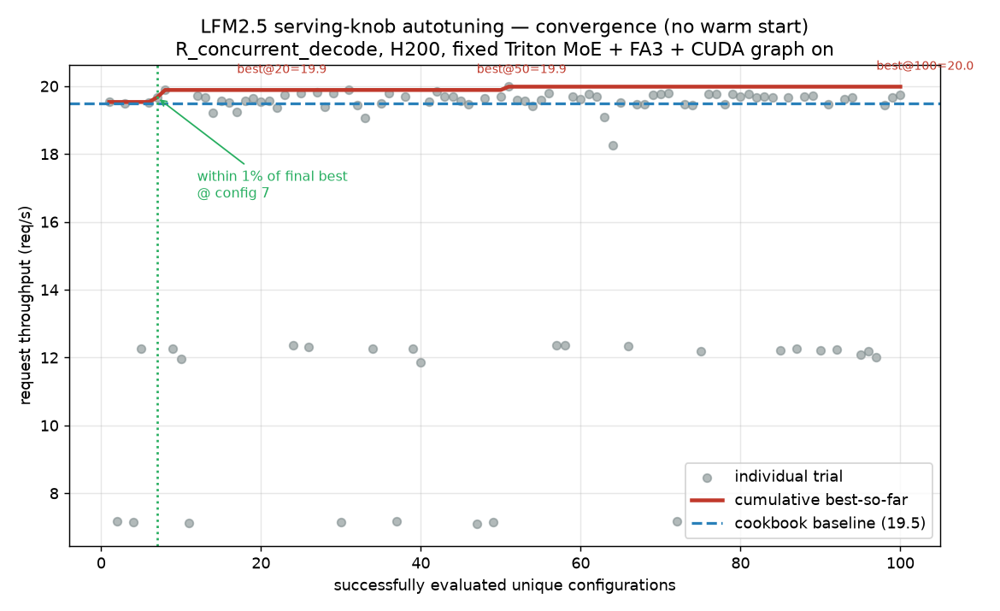
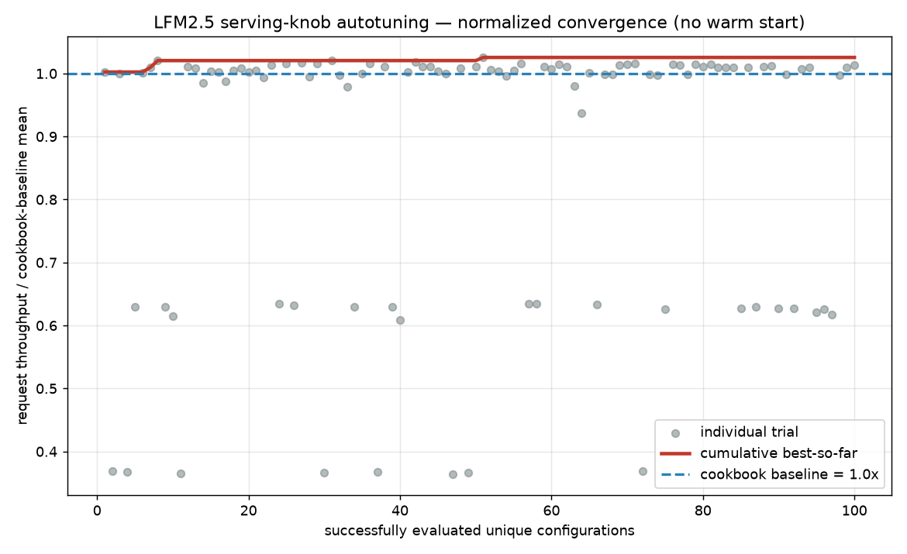
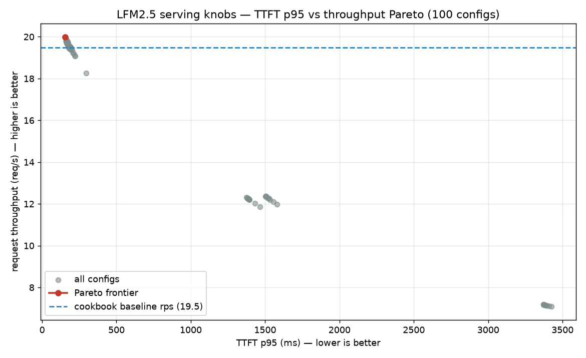

# LFM2.5 Serving-Knob Autotuning: A Clean Plateau Study (no warm start)

**Date:** 2026-07-22 · **Author:** Jialiang
**Purpose:** replace the biased 2026-07-02 v3 warm-started convergence figure with a clean, reproducible, regime-specific autotuning study that shows how performance evolves when Optuna starts with **no known-good configuration**.

---

## 1. Why the old v3 curve was biased

The existing figure under `results/2026-07-02_lfm2.5_v3/optuna-v3-R_concurrent_decode/` cannot be used as clean evidence of autotuning convergence:

1. **Trials 0–3 were manually enqueued warm-start configurations** (`study.enqueue_trial`), so the curve "starts high" by construction.
2. Those warm-start trials **already contained strong cookbook-equivalent configs** (cap=32, chunk=-1, sched=lpm, mem=0.9, cuda-graph on) — the answer was injected before search began.
3. The study **jointly tuned the MoE backend** (auto / triton / flashinfer_cutlass) **and CUDA-graph enablement** alongside serving knobs, conflating kernel-path choice with serving-knob tuning.
4. **CUDA-graph-disabled configs created many artificially poor points**, exaggerating the apparent gap between "before" and "after" tuning.

Any convergence claim from that curve is therefore contaminated by (a) a seeded warm start and (b) confounded kernel-path/CUDA-graph variance.

## 2. What this study fixes

| aspect | v3 (biased) | v48 (this study) |
|---|---|---|
| warm start | trials 0–3 enqueued (cookbook-equivalent) | **none** — fresh study, no `enqueue_trial` |
| MoE path | tuned (auto/triton/flashinfer) | **fixed: triton** |
| CUDA graph | tuned (on/off) → poor points | **always on** (`--disable-cuda-graph` never passed) |
| attention | tuned | **fixed: fa3** |
| sampler start | TPE from trial 4 after warm start | `TPESampler(seed=20260722, n_startup_trials=20, multivariate=True)` — trials 0–19 are sampler startup |
| knobs | 7 (incl. backend, cuda-graph) | **4 serving knobs only** |

## 3. Exact setup

- **Model:** `/data/hf/LFM2.5-8B-A1B` (served name `lfm2.5-8b-a1b`), bf16, TP=1.
- **Fixed server args:** `--moe-runner-backend triton`, `--attention-backend fa3`, CUDA graph on (`disable_cuda_graph=false` verified in every server log), `--context-length 73728`, `--schedule-conservativeness 1.0`, `--max-prefill-tokens 96000`, `--reasoning-parser qwen3`, `--tool-call-parser lfm2`, `--trust-remote-code`. (Same as v3 cookbook, minus the tuned knobs.)
- **Environment** (`environment.json`): sglang 0.5.12.post1 @ `17f7a1da1`, Triton 3.5.1, PyTorch 2.9.1+cu128, CUDA 12.8, driver 580.105.08, H200, Optuna 4.9.0.
- **Workload — R_concurrent_decode:** concurrency=32, output=256, num_prompts=32, input≈256 tokens (reproduces the v3 spec `prompt_words=200`). Objective = **request throughput**.
- **Benchmark client:** `sglang.bench_serving` (streaming, `--output-details`). *This is the one deliberate deviation from v3, whose custom client was non-streaming and could not produce TTFT/TPOT percentiles. The request-throughput objective and the workload shape (concurrency/output/num_prompts/input size) are identical; we upgraded the client to obtain the required latency percentiles. TTFT/TPOT/E2E p50/p95/p99 are computed exactly from the per-request `ttfts`/`itls` arrays.*

## 4. Search space (4 serving knobs, 192 combinations)

| knob | values |
|---|---|
| `max_running_requests` | 8, 16, 24, 32, 48, 64, 96, 128 |
| `chunked_prefill_size` | -1, 2048, 8192 |
| `schedule_policy` | lpm, fcfs |
| `mem_fraction_static` | 0.75, 0.80, 0.85, 0.90 |

100 unique COMPLETE trials required; duplicate proposals PRUNED and re-sampled; failures logged (`failures.csv`) and never counted or fake-scored. This run: **100/100 successful, 0 failures, 26 duplicates pruned (126 attempts).**

## 5. Results

### 5.1 Convergence (no warm start)

- Best-so-far reaches within 1% of the final best at **config 7**.
- best-through 10/20/50/75/100 = 19.89 / 19.89 / 19.89 / 19.98 / 19.98 req/s.
- **Improvement in the final 20 configs = 0.0%** (0 of the last 20 improve best-so-far).
- 42% of configs land within 1% of the best, 70% within 3%, 72% within 5%.
- Throughput spread across 100 configs: **7.09 → 19.98 req/s** — the low end is entirely `max_running_requests = 8` (starved batching).

### 5.2 Normalized convergence

Cumulative best-so-far divided by cookbook-baseline mean. It sits essentially at 1.0× throughout — the search never finds anything meaningfully above cookbook.

### 5.3 TTFT p95 vs throughput Pareto

All 100 configs with the non-dominated frontier highlighted. The frontier is short and flat: near-max throughput is available across a wide band of TTFT p95, and the cookbook already sits on it.

### 5.4 Cookbook baseline (separate reference, 5 runs)

`19.49 ± 0.59 req/s` (95% CI ±0.52). Measured separately, **never enqueued into Optuna**.

### 5.5 Post-search validation (interleaved ×5)

| candidate | validated mean (req/s) | speedup vs cookbook |
|---|---:|---:|
| cookbook | 19.72 | 1.000× |
| **trial_41 (validated best)** | **19.80** | **1.004×** |
| trial_26 | 19.72 | 1.000× |
| trial_7 | 19.70 | 0.999× |
| trial_30 | 19.65 | 0.997× |
| trial_50 (raw #1) | 19.64 | 0.996× |

Raw single-trial ranking `[50,30,7,41,26]` ≠ validated ranking `[41,26,7,30,50]` → **ranking is not stable**; the "best" single-trial config (trial_50) falls to last on re-validation. The final best config is selected by validated mean, and it is **within noise of the cookbook** (+0.4%, CIs overlap).

## 6. Interpretation

For R_concurrent_decode on this model/hardware, the 4-knob serving space is a **plateau**. The only knob with first-order impact is avoiding **starved batching** (`max_running_requests = 8` → ~7 req/s). Once `max_running_requests ≥ ~24`, every configuration — including the cookbook — lands within a few percent of the plateau. TPE identifies this within its 20-trial startup phase; the remaining 80 trials add nothing.

## 7. Limitations

- Single regime (R_concurrent_decode), single model (LFM2.5-8B-A1B), single H200, TP=1.
- The plateau is specific to **this 4-knob serving search space**. It does **not** claim that all inference-optimization headroom is exhausted — kernel-path, speculative decoding, quantization, architecture, and other regimes are out of scope here.
- The client was upgraded from the v3 non-streaming custom runner to `sglang.bench_serving` to obtain latency percentiles; the throughput objective and workload are matched, but absolute req/s are not identical to the v3 custom-client numbers.

## 8. Justified claim for the slide

> "Without a seeded warm start, autotuning discovers the useful region after **7** configurations. The final **20** configurations improve the best-so-far throughput by only **0%**, indicating diminishing returns within this fixed serving-knob search space."

## 9. Reproduce

`results/2026-07-22_lfm25_plateau_100/reproduce.sh` (study → baseline → validation → plots). Scripts: `scripts/run_v48_lfm25_plateau.py`, `run_v48_baseline.py`, `run_v48_validate.py`, `run_v48_plots.py`.
